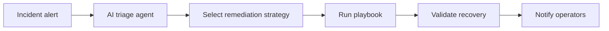

# AI Incident Triage

Coming soon. When an incident alert fires, an AI agent analyzes context, selects a remediation strategy, and routes to the appropriate AAP playbook.

> Single-service check-and-remediate (start, restart, install) lives under [service-health/](../../service-health/).

## Workflow

## Playbooks

🚧 **Under development** — playbook list and source links will be added when this demo is built.
