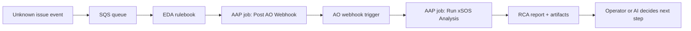

# Event-Driven xSOS RCA

**Status: Active (nostromo)** — SQS → EDA → AO webhook path verified. Playbooks and rulebook in this repo support automated root-cause analysis with [xSOS](https://github.com/ryran/xsos) on the affected host.

## What this demo shows

A monitoring or ticketing integration cannot classify an incident. Instead of guessing a remediation playbook, automation:

1. Receives an **unknown issue** event from **AWS SQS**
2. **EDA** launches an AAP job that **POSTs** the event to the **automation orchestrator (AO) webhook**
3. **AO** starts a workflow and launches **Linux - Run xSOS Analysis** on the reported host
4. **xSOS** collects a fast, human-readable system summary for operators or an AI agent to reason over

This pattern complements automation orchestrator agent workflows: EDA reacts to the event; xSOS gathers facts; AO or MCP can decide next steps.

## Suggested folder name

`event-driven-xsos-rca` (this folder) reads better in a demo catalog than `unknown_error_xsos`. The queue and tags still use `unknown-issue` language where it helps operators.

## Workflow

On **AAP**, EDA cannot call an external webhook directly. The supported path routes through Controller:

```text
AWS SQS  →  EDA rulebook  →  run_job_template (Post AO Webhook)  →  AO webhook  →  Run xSOS Analysis
```



The extra Controller hop is **expected platform behavior**, not a workaround. See [EDA actions on AAP](#eda-actions-on-aap) below.

## EDA actions on AAP

`ansible-rulebook` supports `run_module`, `run_playbook`, `run_job_template`, and `run_workflow_template`. On **AAP-managed EDA activations**, only **Controller-backed actions** are supported:

| Action | AAP EDA activation | Notes |
|--------|-------------------|-------|
| `run_job_template` | **Supported** | What this demo uses |
| `run_workflow_template` | **Supported** | Alternative for multi-step Controller workflows |
| `run_module` | **Not supported** | Needs `--inventory` at worker startup; EDA UI has no inventory field |
| `run_playbook` | **Not supported** | Documented as CLI-only on AAP 2.6 |

**Why:** AAP EDA was designed so rulebooks do not run automation outside Automation Controller. The rulebook engine still allows `run_module` when you run `ansible-rulebook` locally with `-i inventory.ini`, but the EDA controller worker does not pass inventory and will fail at startup with `needs inventory to be defined`.

**Product guidance (EDA PM):** On AAP, use `run_job_template` or `run_workflow_template`. Direct `run_module` / `run_playbook` from an activation is not the supported integration path.

For AO specifically, the practical chain is:

```text
event source (e.g. AWS SQS) → EDA → Job Template → AO webhook → AO workflow → AAP jobs
```

An alternate rulebook using `run_module` + `ansible.builtin.uri` lives at [`eda/rulebook-run-module.yml`](eda/rulebook-run-module.yml) for **local CLI testing only**. Do not enable it as an AAP activation.

## Playbooks

| Playbook | Purpose | When to run |
|---|---|---|
| [`setup_sqs_queue.yml`](playbooks/setup_sqs_queue.yml) | Create the SQS queue (one-time) | Once per AWS account/region |
| [`publish_unknown_issue_event.yml`](playbooks/publish_unknown_issue_event.yml) | Push a demo event to SQS | Manual test / smoke test |
| [`post_ao_webhook.yml`](playbooks/post_ao_webhook.yml) | POST event JSON to AO webhook | **EDA** via `run_job_template` (JT: Linux - Post AO Webhook) |
| [`run_xsos_analysis.yml`](playbooks/run_xsos_analysis.yml) | Install xSOS, run analysis, save report | **AO workflow** (JT: Linux - Run xSOS Analysis) |

## Quick start

### 1. One-time queue setup

Requires AWS credentials with permission to create SQS queues (`amazon.aws` collection).

```bash
cd event-driven-xsos-rca
ansible-playbook -i inventory/hosts.yml playbooks/setup_sqs_queue.yml
```

Copy the printed **Queue URL** into `inventory/group_vars/all.yml`:

```yaml
sqs_queue_url: https://sqs.us-east-1.amazonaws.com/123456789012/aap-unknown-issue-rca
```

### 2. Configure inventory

Set the host xSOS should analyze:

```bash
export RCA_TARGET_HOST=10.0.1.50
export RCA_TARGET_USER=ec2-user
export RCA_TARGET_SSH_KEY=~/.ssh/my-key.pem
```

Update `inventory/group_vars/all.yml`:

```yaml
target_host: rca-target
```

### 3. Publish a demo event

```bash
ansible-playbook -i inventory/hosts.yml playbooks/publish_unknown_issue_event.yml \
  -e issue_summary="API latency spike on web tier — cause unknown"
```

Sample payload shape: [`test/sample_event.json`](test/sample_event.json).

### 4. EDA rulebook and activation

Rulebook (AAP): [`extensions/eda/rulebooks/event-driven-xsos-rca.yml`](../extensions/eda/rulebooks/event-driven-xsos-rca.yml)

Full setup checklist: [`eda/SETUP_EDA.md`](eda/SETUP_EDA.md)

Summary:

1. Sync the Git project in **Automation Decisions → Projects**
2. Create job templates:
   - **`Linux - Post AO Webhook`** → `event-driven-xsos-rca/playbooks/post_ao_webhook.yml` (called by EDA)
   - **`Linux - Run xSOS Analysis`** → `event-driven-xsos-rca/playbooks/run_xsos_analysis.yml` (called by AO workflow)
3. Create an AO workflow with an **EDA webhook trigger**; copy the webhook URL into activation extra vars
4. Create a rulebook activation with **AAP Controller credential**, **AWS SQS credential**, and extra vars:

```yaml
aws_region: us-east-1
xsos_event_queue_name: aap-unknown-issue-rca
ao_webhook_url: http://<ao-host>:8080/api/v1/webhooks/eda/<uuid>
ao_webhook_validate_certs: false
```

5. Run `publish_unknown_issue_event.yml` — within ~5 seconds EDA should launch **Post AO Webhook**, then AO should start the xSOS workflow

The rulebook uses **`run_job_template`**, not `run_module`, because AAP EDA only supports Controller-backed actions. The SQS source exposes your JSON payload as **`event.body`** in the rulebook (not `event.payload`).

### 5. Manual test (without EDA)

```bash
ansible-playbook -i inventory/hosts.yml playbooks/run_xsos_analysis.yml \
  -e _host=rca-target \
  -e issue_summary="Manual xSOS smoke test"
```

Reports land on the target under `xsos_output_dir` (default `/var/tmp/xsos-rca/`). Artifacts are published via `set_stats` for downstream AO steps.

## Prerequisites

| Component | Required | Notes |
|---|---|---|
| RHEL host | Yes | SSH from AAP; xSOS runs on the affected system |
| AWS account | Yes | SQS queue + credentials on controller |
| AAP Controller | Yes | Job templates for the three playbooks |
| EDA | Yes | SQS source → `run_job_template` → Post AO Webhook → AO |
| AAP Controller credential on EDA activation | Yes | Required for `run_job_template` |
| `amazon.aws` collection | Yes | SQS source plugin in decision environment |

## IAM (minimum)

**Setup / publish (controller):**

- `sqs:CreateQueue`, `sqs:GetQueueUrl`, `sqs:GetQueueAttributes`, `sqs:SendMessage`

**EDA SQS source:**

- `sqs:ReceiveMessage`, `sqs:DeleteMessage`, `sqs:GetQueueAttributes`

Use an instance role, access keys in a credential, or AAP cloud credential — match your environment.

## AWS credentials: laptop vs. AAP

`setup_sqs_queue.yml` and `publish_unknown_issue_event.yml` are the two playbooks you'd run manually (setup once, publish to smoke-test). Both default `aws_profile` to your local `saml` SSO profile for convenience on a laptop — that session expires periodically (Kerberos ticket + SAML token), so if you hit `ProfileNotFound` or `ExpiredToken`, re-run your normal AWS SSO login (e.g. `kinit`, then `aws-saml.py`) and retry.

If either playbook is ever run **on AAP** (job template with an AWS credential attached), pass `-e aws_profile=""` so the scripts skip profile lookup entirely and fall back to the credentials AAP injects (access key/secret or instance role) — no laptop session involved, and nothing expires.

## Next steps

- Optionally chain to automation orchestrator: xSOS artifacts → Task Agent → approval → remediation job template
- Register on the demo site in `_data/demos.yml` when ready to publish
