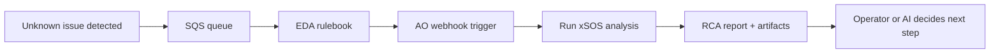

# Event-Driven xSOS RCA

**Status: Scaffold** — playbooks for a customer use case: an unknown issue event triggers automated root-cause analysis with [xSOS](https://github.com/ryran/xsos) on the affected host.

## What this demo shows

A monitoring or ticketing integration cannot classify an incident. Instead of guessing a remediation playbook, automation:

1. Receives an **unknown issue** event from **AWS SQS**
2. **EDA** POSTs the event to the **automation orchestrator webhook**
3. **AO** launches xSOS analysis on the reported host via AAP
4. **xSOS** collects a fast, human-readable system summary for operators or an AI agent to reason over

This pattern complements automation orchestrator agent workflows: EDA reacts to the event; xSOS gathers facts; AO or MCP can decide next steps.

## Suggested folder name

`event-driven-xsos-rca` (this folder) reads better in a demo catalog than `unknown_error_xsos`. The queue and tags still use `unknown-issue` language where it helps operators.

## Workflow



## Playbooks

| Playbook | Purpose | When to run |
|---|---|---|
| [`setup_sqs_queue.yml`](playbooks/setup_sqs_queue.yml) | Create the SQS queue (one-time) | Once per AWS account/region |
| [`publish_unknown_issue_event.yml`](playbooks/publish_unknown_issue_event.yml) | Push a demo event to SQS | Any time you want to simulate an alert |
| [`run_xsos_analysis.yml`](playbooks/run_xsos_analysis.yml) | Install xSOS, run analysis, save report | EDA trigger (or manual test) |

## Quick start

### 1. One-time queue setup

Requires AWS credentials with permission to create SQS queues (`amazon.aws` collection).

```bash
cd event-driven-xsos-rca
ansible-playbook -i inventory/hosts.yml playbooks/setup_sqs_queue.yml
```

Copy the printed **Queue URL** into `group_vars/all.yml`:

```yaml
sqs_queue_url: https://sqs.us-east-1.amazonaws.com/123456789012/aap-unknown-issue-rca
```

### 2. Configure inventory

Set the host xSOS should analyze:

```bash
export RCA_TARGET_HOST=10.0.1.50
export RCA_TARGET_USER=ec2-user
export RCA_TARGET_SSH_KEY=~/.ssh/my-key.pem
```

Update `group_vars/all.yml`:

```yaml
target_host: rca-target
```

### 3. Publish a demo event

```bash
ansible-playbook -i inventory/hosts.yml playbooks/publish_unknown_issue_event.yml \
  -e issue_summary="API latency spike on web tier — cause unknown"
```

Sample payload shape: [`test/sample_event.json`](test/sample_event.json).

### 4. EDA rulebook and activation

Rulebook: [`extensions/eda/rulebooks/event-driven-xsos-rca.yml`](../extensions/eda/rulebooks/event-driven-xsos-rca.yml)

Full setup checklist: [`eda/SETUP_EDA.md`](eda/SETUP_EDA.md)

Summary:

1. Sync the Git project in **Automation Decisions → Projects**
2. Create job template **`Linux - Run xSOS Analysis`** with **Prompt on launch → Extra Variables** enabled
3. Create a rulebook activation with AWS credential + extra vars:

```yaml
aws_region: us-east-1
xsos_event_queue_name: aap-unknown-issue-rca
xsos_job_template_name: Linux - Run xSOS Analysis
aap_organization: Default
```

4. Run `publish_unknown_issue_event.yml` — EDA should launch the analysis job within ~5 seconds

The SQS source exposes your JSON payload as **`event.body`** in the rulebook (not `event.payload`).

### 5. Manual test (without EDA)

```bash
ansible-playbook -i inventory/hosts.yml playbooks/run_xsos_analysis.yml \
  -e target_host=rca-target \
  -e issue_id=manual-test-001 \
  -e issue_summary="Manual xSOS smoke test"
```

Reports land on the target under `xsos_output_dir` (default `/var/tmp/xsos-rca/`). Artifacts are published via `set_stats` for downstream AO steps.

## Prerequisites

| Component | Required | Notes |
|---|---|---|
| RHEL host | Yes | SSH from AAP; xSOS runs on the affected system |
| AWS account | Yes | SQS queue + credentials on controller |
| AAP Controller | Yes | Job templates for the three playbooks |
| EDA | Yes | SQS source → `run_xsos_analysis.yml` |
| `amazon.aws` collection | Yes | Already in repo [`collections/requirements.yml`](../../collections/requirements.yml) |
| AWS CLI | For publish playbook | Used by `publish_unknown_issue_event.yml` |

## IAM (minimum)

**Setup / publish (controller):**

- `sqs:CreateQueue`, `sqs:GetQueueUrl`, `sqs:GetQueueAttributes`, `sqs:SendMessage`

**EDA SQS source:**

- `sqs:ReceiveMessage`, `sqs:DeleteMessage`, `sqs:GetQueueAttributes`

Use an instance role, access keys in a credential, or AAP cloud credential — match your environment.

## Next steps

- Optionally chain to automation orchestrator: xSOS artifacts → Task Agent → approval → remediation job template
- Register on the demo site in `_data/demos.yml` when ready to publish
