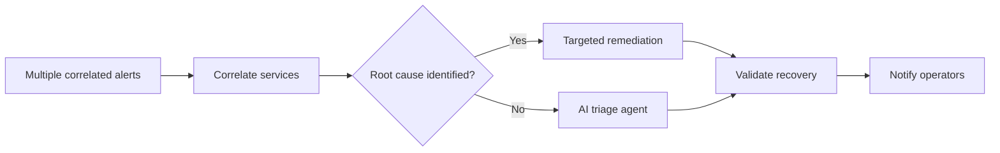

# Multi-Service Correlation

Coming soon. Multiple correlated alerts arrive across services. The workflow correlates them, identifies root cause when possible, and routes to targeted remediation or AI-assisted triage when not.

## Workflow

## Playbooks

🚧 **Under development** — playbook list and source links will be added when this demo is built.
