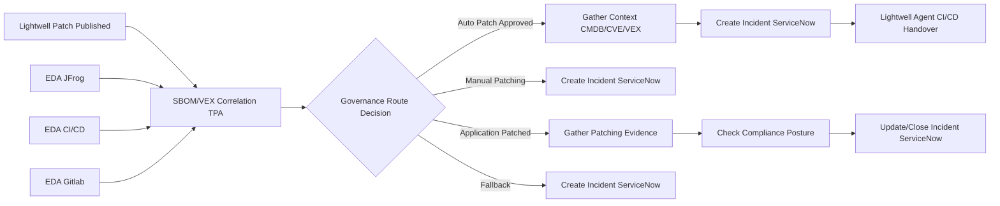

# Lightwell Fast Path

**Interactive walkthrough:** [Lightwell Fast Path](https://interact.redhat.com/share/4NErwCgHHnKXvNQKf6JY) (Red Hat Interact Arcade)

## What this demo shows

Patch publications from **Lightwell**, **JFrog**, **CI/CD**, or **GitLab** enter automation orchestrator through manual and **EDA triggers**. An **SBOM/VEX correlation** job evaluates the publication against policy and publishes a **governance route** artifact. A **switch node** routes the workflow into one of four paths: auto-approved patching with CI/CD handover, manual patching with ServiceNow incident creation, post-deploy evidence and compliance verification, or a fallback for unresolved governance decisions.

The auto-approved path gathers **CMDB/CVE/VEX context** through an AAP workflow, creates a ServiceNow incident, and hands off to a **Lightwell agent** that produces a structured CI/CD deployment checklist. The deployed path collects patching evidence, checks compliance posture, and closes the ServiceNow incident.

## Workflow



### Step-by-step

| Step | Node | Type | What it does |
|------|------|------|--------------|
| 1 | **Lightwell Patch Published - Manual** | Manual trigger | Operator publishes a patch artifact with name, version, and optional CVE list |
| 1 | **EDA Notification from JFrog / CI/CD / Gitlab** | EDA trigger | Rulebook routes artifact publication or deployment events into automation orchestrator |
| 2 | **SBOM/VEX Correlation TPA** | AAP job | Correlates SBOM and VEX data, evaluates policy, publishes `governance_route` artifact |
| 3 | **Governance Route Decision** | Switch | Routes on `${sbom_vex_correlation.artifacts.governance_route}` — four cases below |

#### Auto Patch Approved path (Policy Approved)

| Step | Node | Type | What it does |
|------|------|------|--------------|
| 4a | **Gather Context - CMDB/CVE/VEX** | AAP workflow | Multi-step context gathering from CMDB, CVE, and VEX sources |
| 5a | **Create Incident - ServiceNow** | AAP job | Opens a tracking incident for the approved auto-patch |
| 6a | **Lightwell Agent handover for CI/CD** | Task agent | Produces CI/CD handover checklist with pre/post-deploy validation steps |

#### Manual Patching required path (Policy Enforced)

| Step | Node | Type | What it does |
|------|------|------|--------------|
| 4b | **Create Incident ServiceNow** | AAP job | Opens incident for operator-driven patching |

#### Application Patched/Deployed path

| Step | Node | Type | What it does |
|------|------|------|--------------|
| 4c | **Gather Patching evidence** | AAP job | Collects deployment ID, pipeline URL, SBOM/VEX attachment status |
| 5c | **Check Compliance Posture** | AAP job | Validates policy bundle compliance from evidence artifacts |
| 6c | **Update/Close Incident ServiceNow** | AAP job | Closes incident (state 6) with evidence and compliance summary |

#### Fallback path

| Step | Node | Type | What it does |
|------|------|------|--------------|
| 4d | **Create Incident ServiceNow (Fallback)** | AAP job | Opens incident when governance route cannot be determined |

## Route logic

| Route | Condition | Action |
|-------|-----------|--------|
| `auto_patch_approved` | Clean SBOM/VEX, no blocking CVEs, policy approved | Gather context → Create incident → Lightwell CI/CD handover agent |
| `manual_patching_required` | Policy review required or blocking CVEs present | Create ServiceNow incident for manual patching |
| `application_patched` | GitLab/CI/CD deployment completed | Gather evidence → Check compliance → Close incident |
| `fallback` | Governance route undetermined | Create ServiceNow incident for manual review |

## Components (defaults — swappable)

| Component | Default in demo | Notes |
|-----------|-----------------|-------|
| Patch ingress | Manual trigger + EDA (JFrog, CI/CD, GitLab) | Any system that can POST artifact metadata to AO |
| SBOM/VEX correlation | AAP job template | Publishes `governance_route` for switch routing |
| Context gathering | AAP workflow template | `Lightwell \| Gather Context` — define in AAP |
| ITSM integration | ServiceNow REST API | Create/update/close incidents via job templates |
| CI/CD handover | Task agent | Structured JSON handover checklist for pipeline operators |
| Orchestration | Automation orchestrator | Triggers → correlation → switch → three primary paths + fallback |

## AO building blocks

| Building block | Where |
|----------------|-------|
| Manual trigger | Lightwell Patch Published |
| EDA trigger (×3) | JFrog, CI/CD, GitLab notifications |
| AAP job template (×5) | SBOM/VEX Correlation, Create Incident, Gather Evidence, Check Compliance, Update Ticket |
| AAP workflow template | Gather Context - CMDB/CVE/VEX |
| Switch node | Governance Route Decision |
| Task agent | Lightwell Agent handover for CI/CD |
| Artifact-based routing | Switch routes on `governance_route` from correlation job |

## Playbooks

| Playbook | Job Template Name | Runs on | Purpose |
|----------|-------------------|---------|---------|
| `sbom_vex_correlation.yml` | Lightwell \| SBOM/VEX Correlation TPA | localhost | Correlates SBOM/VEX, publishes governance route artifact |
| `create_snow_incident.yml` | Lightwell \| Create ServiceNow Incident | localhost | Creates ServiceNow incident from patch context |
| `gather_patching_evidence.yml` | Lightwell \| Gather Patching Evidence | localhost | Collects deployment and SBOM/VEX evidence |
| `check_compliance_posture.yml` | Lightwell \| Check Compliance Posture | localhost | Evaluates compliance posture from evidence |
| `update_snow_ticket.yml` | Lightwell \| Update ServiceNow Ticket | localhost | Posts work notes and updates/closes ticket state |
| `remediate_disk_cleanup.yml` | Incidents \| Capacity - Disk Cleanup | RHEL target | Optional target-host playbook (shared with ticket-enrichment pattern) |
| `remediate_process_cleanup.yml` | Incidents \| High CPU - Process Cleanup | RHEL target | Optional target-host playbook (shared with ticket-enrichment pattern) |

## Artifacts

```
lightwell-fast-path/
  README.md              # this file
  REQUIREMENTS.md        # setup guide
  ao/
    lightwell-fast-path.json   # AO workflow JSON (import into automation orchestrator)
  playbooks/
    sbom_vex_correlation.yml       # SBOM/VEX correlation + governance routing
    create_snow_incident.yml         # ServiceNow incident creation
    gather_patching_evidence.yml     # Post-deploy evidence collection
    check_compliance_posture.yml     # Compliance posture validation
    update_snow_ticket.yml           # SNOW ticket update/close
    remediate_disk_cleanup.yml       # optional RHEL target remediation
    remediate_process_cleanup.yml    # optional RHEL target remediation
  test/
    snow-incident-simulate.yml       # Fire demo scenarios against AO
```

## Relationship to other demos

| Demo | Contrast |
|------|----------|
| **Lightwell Fast Path** (this) | Patch publication ingress → SBOM/VEX correlation → governance switch → auto-patch CI/CD handover, manual incident, or post-deploy compliance |
| [Ticket Enrichment](../ticket-enrichment/) | ServiceNow webhook → AI triage → switch routes to auto-remediate / approval / enrich-and-assign |
| [CVE Remediation](../cve-remediation/) | CVE alert → AI triage → switch: auto-patch dev, approve prod, investigate |
| [Disk Utilization](../disk-utilization/) | Switch routes on disk_use_percent — no AI, deterministic thresholds |
