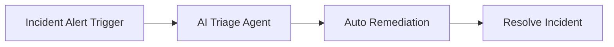

# Ticket Enrichment

**Status: Coming soon** — Arcade walkthrough and workflow design are documented; AO workflow JSON and AAP playbooks will be added when the contributor uploads files.

**Interactive walkthrough:** [Automation Orchestrator — Ticket Enrichment](https://interact.redhat.com/share/j5xLvTSv2GAkw6szxron) (Red Hat Interact Arcade)

## What this demo shows

ServiceNow is the **ticket ingress**: an incident alert arrives on a webhook (`/incident-alert`). Two **agentic AI nodes** bookend the workflow — triage first, resolve last — with a **dynamic AAP job** in the middle. There is **no switch node**: the first agent decides which job template to run and passes the name downstream as a variable.

That pattern is the headline: **AI chooses the remediation playbook at runtime**, not a fixed dropdown or a multi-branch switch graph.

Default model in the canvas is **Claude Sonnet** (`claude-sonnet-4-6`); both agent nodes and the ServiceNow integration can be swapped for your environment.

## Workflow



Marketplace diagram (AO node icons): [`workflow.mermaid`](workflow.mermaid) and `_data/demos.yml`.

### Step-by-step

| Step | Node | Type | What it does |
|------|------|------|----------------|
| 1 | **Incident Alert Trigger** | Webhook (`/incident-alert`) | ServiceNow (or another ITSM) posts the incident payload into automation orchestrator |
| 2 | **AI Triage Agent** | Agentic (`claude-sonnet-4-6`) | Fetches and analyzes the ticket via ServiceNow MCP; outputs structured JSON including **`job_template_name`** |
| 3 | **Auto Remediation** | AAP job (dynamic) | Launches the job template named by the triage agent — see [dynamic job template](#dynamic-job-template) |
| 4 | **Resolve Incident** | Agentic (`claude-sonnet-4-6`) | Updates ServiceNow via MCP — close notes, customer comment, resolved state |

## Dynamic job template

The **Auto Remediation** step uses an **expression** for the job template name instead of a fixed dropdown — the same idea as enabling **Use expressions** on an AAP job step and referencing upstream agent output:

```text
${triage_agent.result.content.job_template_name}
```

The triage agent prompt instructs the model to pick the correct template from available AAP job templates (e.g. disk cleanup vs. service restart) based on incident context. The workflow stays linear: **no switch**, **no hardcoded template list** in the canvas.

## Components (defaults — swappable)

| Component | Default in demo | Notes |
|-----------|-----------------|-------|
| Ticket ingress | ServiceNow → webhook | Any system that can POST JSON to `/incident-alert` works |
| ITSM integration | ServiceNow MCP | Fetch incident, work notes, comments, state updates |
| AI model | `claude-sonnet-4-6` | Both agentic nodes; replace credential/model as needed |
| Remediation | Dynamic AAP job template | Name supplied by triage agent at runtime |
| Orchestration | Automation orchestrator | Four-node linear workflow |

## AO building blocks

| Building block | Where |
|----------------|-------|
| Webhook trigger | Incident Alert Trigger |
| Agentic node (×2) | AI Triage Agent, Resolve Incident |
| ServiceNow MCP | Both agentic nodes |
| AAP job template (dynamic expression) | Auto Remediation |

## Planned artifacts

```
ticket-enrichment/
  README.md              # this file
  REQUIREMENTS.md        # setup checklist
  workflow.mermaid       # diagram source
  ao/                    # automation orchestrator workflow JSON (pending upload)
  aap/playbooks/         # remediation playbooks referenced by dynamic JT names (pending upload)
```

## Relationship to other demos

| Demo | Contrast |
|------|----------|
| **Ticket Enrichment** (this) | Linear flow; **dynamic** job template from AI; **no switch** |
| [AI Incident Triage](../ai-incident-triage/) | Switch routes auto-remediate / approval / inform-only with **fixed** job templates per branch |
| [Intelligent Cert Lifecycle](../cert-lifecycle/) | AI picks template + **approval gate** before run |

## Next steps

1. Contributor uploads AO workflow JSON → `ao/`
2. Add AAP playbooks the triage agent can select → `aap/playbooks/`
3. Complete `REQUIREMENTS.md` (ServiceNow instance, MCP creds, webhook URL)
4. Set `workflow_json` in `_data/demos.yml` and flip `status` to `active`
